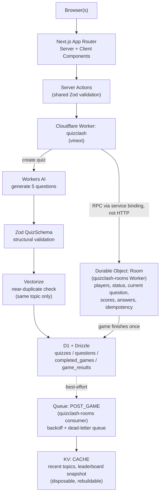

# QuizClash

A small multiplayer quiz game: a host picks a topic, an AI model writes 5
questions on the spot, 2–6 players join with a room code, everyone answers
the same 5 questions, and a final ranking appears once the last question
closes. Built as a Next.js App Router application deployed to Cloudflare
Workers via [vinext](https://vinext.dev), as a deliberately small
2–3-day exercise in five Cloudflare building blocks: D1, Durable Objects,
Workers AI + Vectorize, KV, and Queues.

See `CLAUDE.md`/`ARCHITECTURE.md` for the full locked spec,
and [`docs/NOTES.md`](docs/NOTES.md) for documentation.

## Prerequisites

- Node.js 20.9+ (this project has been run on Node 26)
- A Cloudflare account (for deploying and for the Workers AI binding)

## Local development

There are two ways to run this app locally, depending on whether you need Cloudflare bindings:

**Plain Next.js (fast iteration, no Cloudflare bindings):**

```bash
npm install
npm run dev
```

Open [http://localhost:3000](http://localhost:3000). This runs on Node, not the Workers runtime — routes that use a Cloudflare binding (e.g. `/api/health`'s runtime check, or anything using `env.AI`) won't behave the same here.

**Under the real Workers runtime (needed once bindings are involved):**

```bash
npm run build:vinext
npm run start:vinext
```

This builds with vinext and runs the built Worker locally via Wrangler at [http://localhost:8787](http://localhost:8787). Requires `npx wrangler login` and a `workers.dev` subdomain on your account (registered automatically on first deploy). `wrangler.jsonc` sets `"remote": true` on the `DB`/`CACHE`/`VECTORIZE` bindings, so local dev reads/writes the same real D1/KV/Vectorize resources as production (the `AI` binding is always remote regardless) — there's no separate local-only dataset to keep in sync, but it also means local testing affects real data (there's only one environment for this project).

## Deploying to Cloudflare

This project deploys as **two Cloudflare Workers**: the main `quizclash` Worker (this Next.js app), and a small standalone `quizclash-rooms` Worker (`workers/rooms/`) that hosts the `RoomDurableObject` class and the post-game Queue consumer — vinext owns the main Worker's entrypoint, so a Durable Object class can't be exported from the same bundle; the main Worker reaches it via a cross-script Durable Object binding instead. Deploy the rooms Worker first (the main Worker's binding depends on it existing):

```bash
npx wrangler login
npm run deploy:rooms
npm run build:vinext
npm run deploy:vinext
```

Wrangler will print each deployed `https://<name>.<subdomain>.workers.dev` URL.

**First-time setup under a different Cloudflare account:** the D1 database, KV namespace, Vectorize index, and Queues referenced in `wrangler.jsonc` are tied to the account that created them. On a fresh account, provision your own and update the IDs:

```bash
npx wrangler d1 create quizclash-db --binding DB --update-config
npx wrangler kv namespace create quizclash-cache --binding CACHE --update-config
npx wrangler vectorize create quizclash-questions --preset "@cf/baai/bge-small-en-v1.5" --binding VECTORIZE --update-config
npx wrangler vectorize create-metadata-index quizclash-questions --property-name=topic --type=string
npx wrangler queues create quizclash-post-game
npx wrangler queues create quizclash-post-game-dlq
npx wrangler d1 migrations apply quizclash-db --local
npx wrangler d1 migrations apply quizclash-db --remote
```

**Secrets:** set them with `npx wrangler secret put <NAME>` — never put secret values in `.dev.vars` or `.env*` (both gitignored) or in `wrangler.jsonc` (which *is* committed, since it only holds binding configuration, never secret values).

## Architecture

Two Cloudflare Workers, not one: `quizclash` (this Next.js app, via
vinext) and a small standalone `quizclash-rooms` Worker
(`workers/rooms/`) hosting the `RoomDurableObject` class and the
post-game Queue consumer — vinext owns the main Worker's entrypoint
bundle, so a Durable Object class can't be exported from it directly; the
main Worker reaches `quizclash-rooms` through a cross-script Durable
Object **service binding** (RPC, never HTTP). `quizclash-rooms` is
deployed with `workers_dev: false` — it's never meant to be reached over
public HTTP at all.

