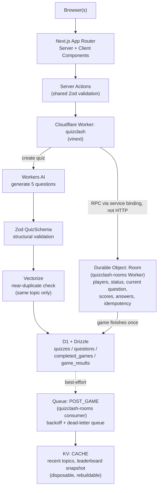

## What QuizClash is

A small multiplayer trivia game: 2–6 players, a host picks a topic, an AI
model writes exactly 5 questions with 4 answers each, players join with a
room code, everyone answers the same 5 questions, and a final ranking
appears once the last question closes. It's a deliberately small,
2–3-day Cloudflare learning exercise — not a production product — built
to exercise five specific Cloudflare building blocks (D1, Durable Objects,
Workers AI + Vectorize, KV, Queues) inside a real Next.js App Router
application.

## Diagram

Two Cloudflare Workers exist, not one: `quizclash` (the Next.js app
itself, via vinext) and `quizclash-rooms` (a small standalone Worker
hosting the `RoomDurableObject` class and the Queue consumer). More on
why in the Durable Object section below.

### Next.js App Router — server/client boundaries

Every route (`/`, `/create`, `/join`, `/room/[code]`, `/game/[code]`,
`/results/[code]`) is a **Server Component by default**. A `page.tsx`
fetches whatever durable/live state it needs (D1 via `getLatestResultsForRoom`,
or the Durable Object's `getPublicState()`) directly on the server and
renders HTML — no client-side data fetching for the initial view anywhere
in the app.

Client Components exist only where genuine browser interactivity is
needed: `CreateForm`/`JoinForm`/`NextRoundForm` (controlled inputs bound to
a Server Action via `useActionState`), `GameBoard` (answer selection,
a per-question countdown, and short-poll-based live updates once a player
has answered), and a handful of tiny polling components
(`RoomStatusPoller`, `LateJoinWaiter`, `EndedRedirect`) whose only job is
to notice a state change on the server and trigger a `router.refresh()`
or navigation — none of them render anything themselves (`return null`).

### Data ownership:

- **D1** — durable relational source of truth: quizzes, questions, completed games, final results.
- **KV** — disposable/rebuildable cache only: recent topics, a leaderboard snapshot. Safe to delete; nothing authoritative lives there.
- **Durable Object** — single-writer coordinator for one *active* room: players, status, current question, scores, idempotent answer replay.
- **Workers AI** — generates the 5 questions; output is never trusted until it passes `QuizSchema` (Zod), and the model's own bias toward writing the correct answer first is corrected server-side.
- **Vectorize** — semantic near-duplicate detection *after* generation, scoped to the same topic. Detects similarity, never factual correctness — this is deliberately not RAG.
- **Queue** — best-effort post-game work (a leaderboard snapshot), sent only after the result is already durable in D1; retries with exponential backoff, then dead-letters rather than dropping silently.

### Server Actions + shared Zod validation

Every mutation — create a room, join, start a round, submit an answer,
start the next round, end the game — is a Next.js Server Action, not a
hand-rolled API route. Each one re-validates its own input with a Zod
schema from `lib/room/schema.ts` (`CreateGameInputSchema`,
`JoinGameInputSchema`, `NextRoundInputSchema`, …) *before* touching any
Cloudflare binding — client-side validation in the form components is a
UX nicety, never the actual trust boundary.

### Cloudflare Workers runtime

Production execution happens in `workerd` (V8 isolates), not a long-lived
Node process — confirmed literally, via `/api/health`'s
`navigator.userAgent === "Cloudflare-Workers"` check from Phase 03. Any
file that touches a Cloudflare binding (`cloudflare:workers`'s `env`)
imports it with a **dynamic `import()` inside a function body**, never a
static top-level import — that's what lets `next build`/`next dev` (plain
Node, used for fast local iteration and for regenerating `.next/types`)
run at all without ever trying to resolve `cloudflare:workers`.

### D1 — durable relational source of truth

`quizzes`, `questions`, `completed_games`, `game_results` — everything
that must outlive a single room's lifetime lives here, via Drizzle. A
completed game is never considered "real" until its D1 row exists;
nothing else in the system is allowed to claim durability that D1 doesn't
back.

### KV — disposable, rebuildable cache

Exactly two things live in KV, and both are allowed to vanish without
breaking anything: a short list of recently-played topics (shown as quick
picks on the create form) and a leaderboard snapshot written by the Queue
consumer. `getRecentTopics()` wraps its own read in a `try/catch` and
returns `[]` on any failure — the UI just shows no quick-pick chips, the
app stays fully correct. Nothing authoritative is ever written to KV.

### Durable Object — single-writer coordinator for an active room

`RoomDurableObject` (in the separate `quizclash-rooms` Worker) is the one
piece of this system with a real single-writer guarantee: Durable Objects
serialize concurrent calls to the same instance via an input gate, so two
`submitAnswer` calls landing "at the same time" can never both read a
stale score and double-increment it — no manual locking code needed
anywhere in this app.

**Why two Workers**: vinext fully owns and generates the main Worker's
entrypoint bundle, and there's no documented hook to inject an additional
exported class (a Durable Object) or a `queue()` handler into that bundle.
`quizclash-rooms` is a small, plain-TypeScript Worker (no Next.js, no
vinext) that exports `RoomDurableObject` and a `queue()` consumer; the
main Worker reaches it through a **cross-script Durable Object binding**
— `env.GAME_ROOMS.getByName(roomCode)` — an RPC call over a Cloudflare
service binding, never an HTTP `fetch()`. `quizclash-rooms` is deployed
with `workers_dev: false`: it's never meant to be reached over public
HTTP at all, only through that binding and the Queue.

The DO owns everything about an *active* room: `players`, `hostPlayerId`,
`status` (`lobby → playing → finished → ended`), the current question
index, `scores`, per-question `answers` (used for the idempotent-replay
guard), and the countdown alarm. It never touches D1, Workers AI, or
Vectorize itself — the main Worker does the actual quiz generation and D1
persistence, and just calls the DO with the already-validated quiz.

### Workers AI — quiz generator

One call generates all 5 questions in one shot (`@cf/meta/llama-4-scout-17b-16e-instruct`,
JSON mode), and a second, separate call embeds the accepted questions
(`@cf/baai/bge-small-en-v1.5`) for the Vectorize check below. AI output is
never trusted until it round-trips through `QuizSchema.safeParse` — and
even after that, the model's own bias toward always writing the correct
answer first is corrected server-side (`shuffleAnswers`, a Fisher–Yates
shuffle that recomputes `correctAnswerIndex`) rather than trusted as-is.

### Vectorize — semantic duplicate detection, not factual verification

After a quiz is generated and validated, its question embeddings are
queried against Vectorize (`topK: 1`, filtered by a normalized `topic`
metadata field) to catch "this looks like a question we've already asked
for this exact topic." A score ≥ 0.92 rejects the quiz — the AI still
generates first; nothing is retrieved from Vectorize and fed back into
the generation prompt. **This is deliberately not RAG.** If regeneration
keeps colliding for a topic that's already been played (common for
narrow, well-known topics), the app falls back to reusing an existing
quiz for that topic rather than failing outright — a graceful fallback,
not the primary path.

### Queue — retryable post-game work

Once a game finishes, the main Worker sends one message to `POST_GAME`
with the final ranking — a **best-effort** side effect, wrapped in
`try/catch`, sent only *after* the result is already durably in D1. The
`quizclash-rooms` consumer folds it into a small "recent completions" list
in KV. On failure it retries with exponential backoff
(`delaySeconds: 2 ** message.attempts`) up to the default retry limit,
then the message is routed to a dead-letter queue
(`quizclash-post-game-dlq`) instead of being silently dropped.

## Reviewer Q&A

**1. Why is an active room in a Durable Object instead of D1 or KV?**
Because an active room needs a real single-writer guarantee: two players
submitting an answer "simultaneously" must never both read a stale score.
A Durable Object's input gate provides that automatically; coordinating
the same guarantee through D1 would mean hand-rolled locking/polling, and
KV has no transactional guarantee at all.

**2. Why can KV be deleted without corrupting the application?**
Because nothing authoritative is ever written there — only a recent-topics
list and a leaderboard snapshot, both rebuildable. `getRecentTopics()`
explicitly catches its own failure and returns an empty list rather than
erroring; D1 remains the only source of truth for which quizzes/games
actually exist.

**3. How do retries avoid double-scoring?**
`submitAnswer`'s idempotency guard is keyed on `(playerId, questionIndex)`
state inside the Durable Object, not on the client-supplied idempotency
key — a replay for a question the player already answered returns the
stored result without touching the score again. This was a deliberate
choice over a client-key-based cache: state-keyed idempotency can't expire
and let a duplicate through the way a TTL cache could.

**4. What validates AI output?**
`QuizSchema` (Zod): exactly 5 questions, exactly 4 distinct non-empty
answers per question, `correctAnswerIndex` restricted to `0|1|2|3`.
Nothing from the model is persisted or shown to a player before it passes
this check.

**5. What is and isn't guaranteed about factual correctness?**
Nothing. Zod proves structure. Vectorize proves similarity to
already-accepted content for the same topic. Neither, together or apart,
proves a question or its marked-correct answer is actually true — an
explicit, documented MVP limitation, not an oversight.

**6. Why was R2 excluded?**
No file or image uploads exist anywhere in this product's scope.

**7. Why was Cron excluded?**
Explicitly out of scope for this project. The one place a
scheduled-style job was actually needed — auto-ending a finished session
nobody closed out — was solved with a **Durable Object Alarm** instead: a
private, per-instance, self-scheduling timer, which is architecturally
distinct from a global Cron Trigger and was never against the "no Cron"
rule.

**8. Which components are Server Components and which are Client
Components?**
Every `page.tsx` is a Server Component. Client Components are limited to:
the three form components with controlled input state
(`CreateForm`/`JoinForm`/`NextRoundForm`), `GameBoard` (answer selection +
live countdown + short-poll updates), and the small status-polling
components (`RoomStatusPoller`, `LateJoinWaiter`, `EndedRedirect`) that
render nothing and exist purely to notice server-side state changes.

**9. What would fail if a Node-only dependency were introduced?**
The build itself — `npx vinext check` / a `next build` under vinext would
surface an incompatibility, and at runtime the Worker would throw
immediately on import (`workerd` has no Node filesystem, no native
binaries, no long-lived process). This project's own dynamic-import
pattern for every `cloudflare:workers`-touching file exists specifically
so a *different* failure mode — accidentally leaking a Workers-only
import into a page that plain `next build`/`next dev` tries to statically
analyze — doesn't happen either.

**10. What happens if Workers AI or the Queue is temporarily
unavailable?**
Workers AI failing during quiz creation returns a clean `ai_unavailable`
error and creates nothing — no D1 row, no Vectorize upsert, no room ever
starts. AI is never required again once a game is already playing. A
Queue failure can't invalidate a finished game at all, because the D1
write happens *before* the Queue send is even attempted; a failed send
retries with backoff and eventually dead-letters rather than disappearing
silently.
